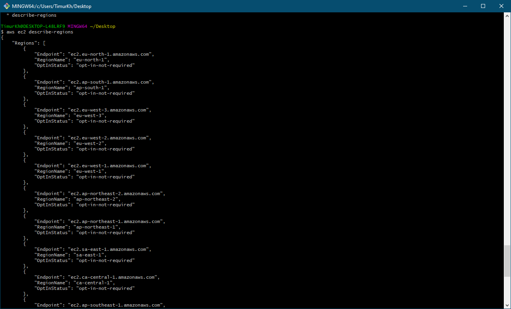
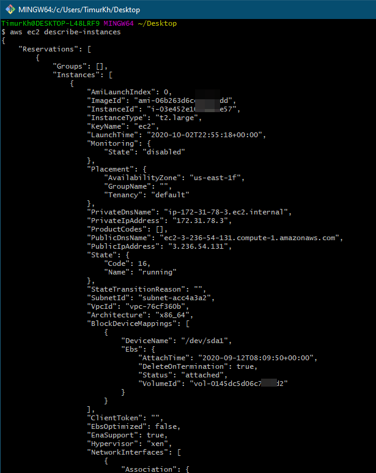
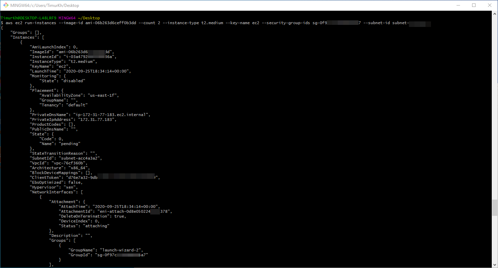
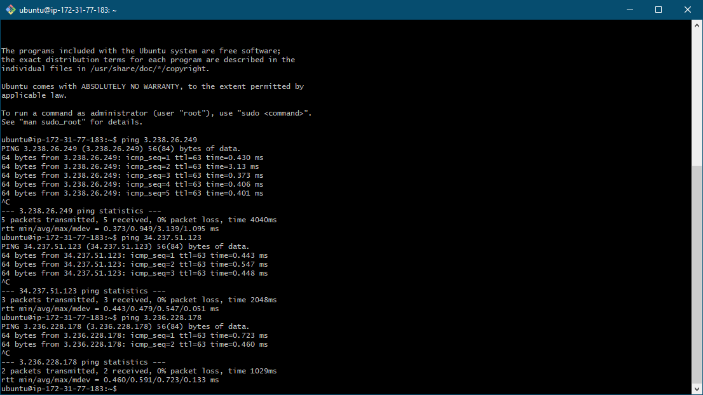
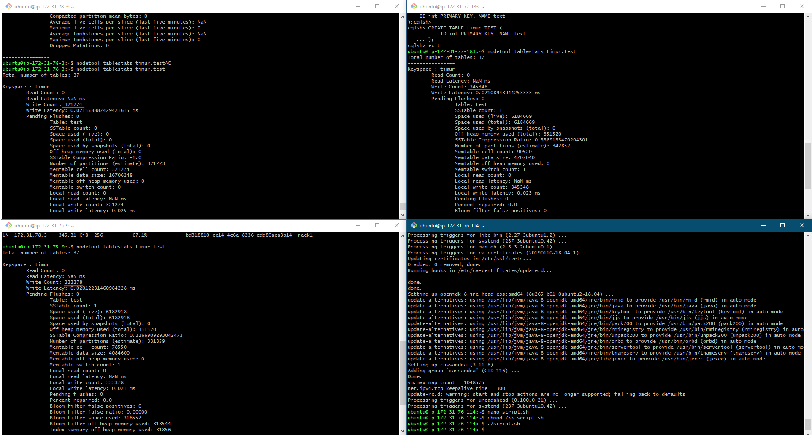

# Cassandra cluster with aws-cli

## Create nodes with aws-cli

Настраиваем авторизацию  
```bash
aws-cli configure
```

Смотрим доступные регионы
```bash
aws ec2 describe-regions
```


Смотрим инстансы
```bash
aws ec2 describe-instances
```


Создаем новые ноды:


Настраиваем inbound rules


Проверяем взаимную доступность серверов с помощью `ping` 


## Configuring Cassandra

+ [Скачать Cassandra](https://cassandra.apache.org/download/)
+ [Инструкция по настройке кластера](https://www.jamescoyle.net/how-to/2448-create-a-simple-cassandra-cluster-with-3-nodes)

### Sample Config
```text
cluster_name: 'Test Cluster'
num_tokens: 256
seed_provider:
    - class_name: org.apache.cassandra.locator.SimpleSeedProvider
        - seeds: 172.31.78.3        # Тут пишем private ip "главной" ноды, можно несколько
listen_address: 10.0.0.3            # Тут пишем собственный private ip address ноды
rpc_address: 10.0.0.3               # Тут пишем собственный private ip address ноды
endpoint_snitch: GossipingPropertyFileSnitch
```

### Проверяем конфигурацию кластера

```bash
nodetool status
```


## Insert data

### Create keyspace and table
```CQL
CREATE KEYSPACE timur
WITH replication = {'class': 'NetworkTopologyStrategy', 'dc1' : 1};

CREATE TABLE timur.TEST (
    ID int PRIMARY KEY, NAME text
);
```

### Bash script
```bash
#!/usr/bin/env bash

for j in {1..1000}
do
    s=""
    for i in {1..1000}
    do
      s="$s insert into timur.TEST(id, name) values ($(( i + 10000 * j )),  'name777');"
    done
    cqlsh 172.31.77.183 -e "$s"
done
```

### Check nodes tables
```bash
nodetool tablestats timur.test
```


+ node1: 321274 (32.12%)
+ node2: 333378 (33.33%)
+ node3: 345348 (34.53%)
sum: 1000000