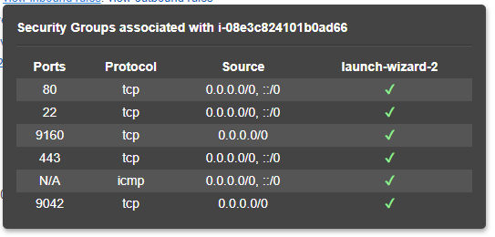

# Cassandra cluster with aws-cli

## Create nodes with aws-cli

Настраиваем авторизацию  
```bash
aws-cli configure
```

Смотрим доступные регионы
```bash
aws ec2 describe-regions
```


Смотрим инстансы
```bash
aws ec2 describe-instances
```


Создаем новые ноды:


Настраиваем inbound rules


Проверяем взаимную доступность серверов с помощью `ping` 


## Configuring Cassandra

+ [Скачать Cassandra](https://cassandra.apache.org/download/)
+ [Инструкция по настройке кластера](https://www.jamescoyle.net/how-to/2448-create-a-simple-cassandra-cluster-with-3-nodes)

### Sample Config
```text
cluster_name: 'Test Cluster'
num_tokens: 256
seed_provider:
    - class_name: org.apache.cassandra.locator.SimpleSeedProvider
        - seeds: 172.31.78.3        # Тут пишем private ip "главной" ноды, можно несколько
listen_address: 10.0.0.3            # Тут пишем собственный private ip address ноды
rpc_address: 10.0.0.3               # Тут пишем собственный private ip address ноды
endpoint_snitch: GossipingPropertyFileSnitch
```

### Проверяем конфигурацию кластера

```bash
nodetool status
```


