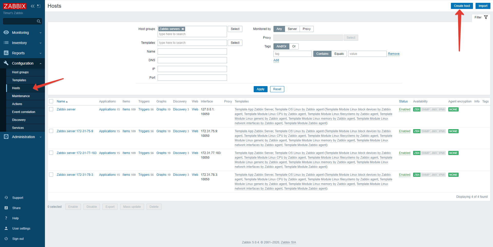
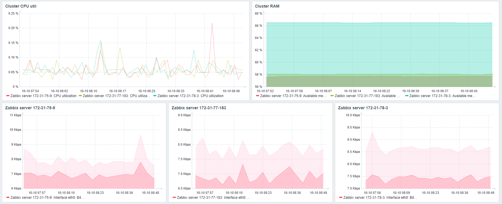

# Zabbix

## Install Zabbix

+ Download Postgres: [postgresql.org/download](https://www.postgresql.org/download/linux/ubuntu/)
+ Download Nginx: `sudo apt install nginx`
+ Download Zabbix: [zabbix.com/download](https://www.zabbix.com/download?zabbix=5.0&os_distribution=ubuntu&os_version=18.04_bionic&db=postgresql&ws=nginx)

## Install Zabbix-agent on nodes

#### Install Zabbix-agent
```bash
wget https://repo.zabbix.com/zabbix/5.0/ubuntu/pool/main/z/zabbix-release/zabbix-release_5.0-1+bionic_all.deb
sudo dpkg -i zabbix-release_5.0-1+bionic_all.deb
sudo apt update

sudo apt-get install zabbix-agent
```

#### Edit Zabbix-agent config
```text
Server=192.168.1.11         # Private Zabbix Server IP (Node №4) 
Hostname=ubuntuserver       # Current node hostname
```
#### Restart Zabbix-agent
```bash
sudo /etc/init.d/zabbix-agent restart
```

## Add nodes to zabbix

#### Create nodes 


With templates:
`
Template App Zabbix Server, Template OS Linux by Zabbix agent (Template Module Linux block devices by Zabbix agent, Template Module Linux CPU by Zabbix agent, Template Module Linux filesystems by Zabbix agent, Template Module Linux generic by Zabbix agent, Template Module Linux memory by Zabbix agent, Template Module Linux network interfaces by Zabbix agent, Template Module Zabbix agent)
`

#### Add Graphs to Dashboard

1. Custer CPU util
1. Available RAM
1. Network IOPS


