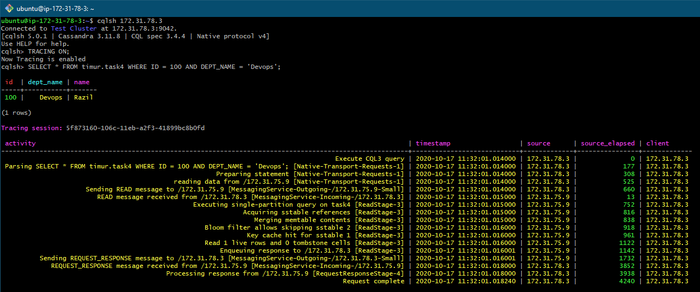
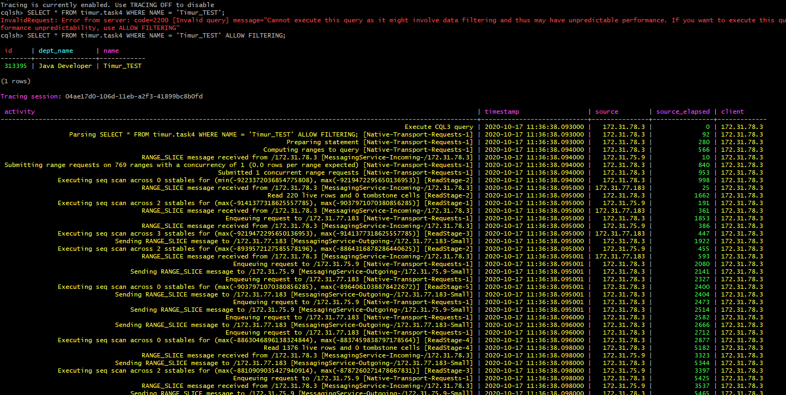
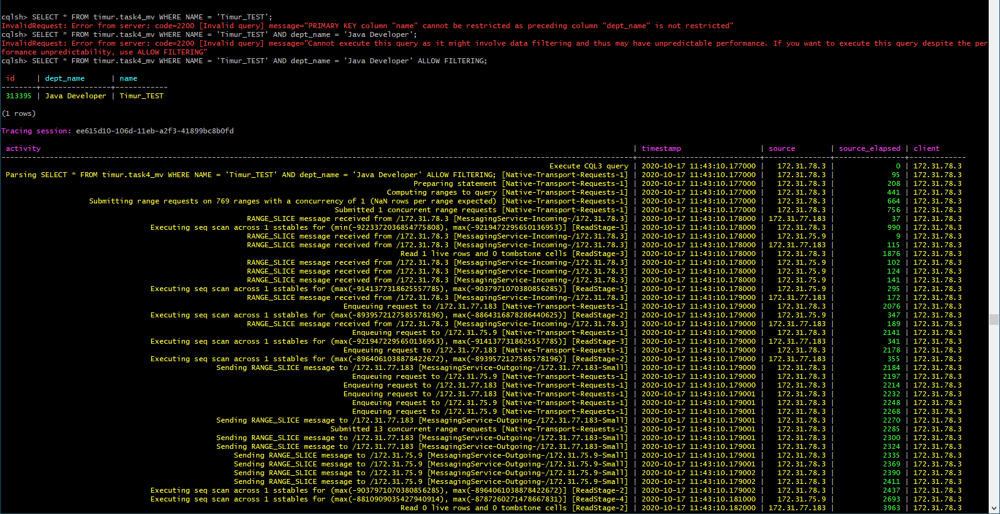

### 1. Create new table

Создать новую таблицу состоящую из 3 столбцов (ID, DEPT_NAME, NAME) с первичным ключом ( (ID), DEPT_NAME ) , где ID - ключ распределения, DEPT_NAME - ключ сортировки

```CQL
CREATE TABLE timur.task4
(
    ID        int,
    NAME      text,
    DEPT_NAME text,
    PRIMARY KEY ( (ID), DEPT_NAME )
) WITH CLUSTERING ORDER BY (DEPT_NAME ASC);
```

### 2. Fill table with 1000000 random rows
Заполнить таблицу произвольными данными в порядке 1 000 000 строк

+ [NodeJS script](insert.js)

### 3. Select with tracing on

```cql
SELECT * FROM timur.task4 WHERE ID = 100 AND DEPT_NAME = 'Devops';
```


```cql
SELECT * FROM timur.task4 WHERE NAME = 'Timur_TEST';
SELECT * FROM timur.task4 WHERE NAME = 'Timur_TEST' ALLOW FILTERING;
```

+ [full log](log2.txt)

### 4. Create Materialized View

```cql
CREATE MATERIALIZED VIEW timur.task4_mv AS
SELECT *
FROM timur.task4
WHERE name IS NOT NULL AND dept_name IS NOT NULL
PRIMARY KEY ( (id), dept_name, name );
```

```cql
SELECT * FROM timur.task4_mv WHERE NAME = 'Timur_TEST';
SELECT * FROM timur.task4_mv WHERE NAME = 'Timur_TEST' AND dept_name = 'Java Developer';
SELECT * FROM timur.task4_mv WHERE NAME = 'Timur_TEST' AND dept_name = 'Java Developer' ALLOW FILTERING;
```


+ [full log](log3.txt)


