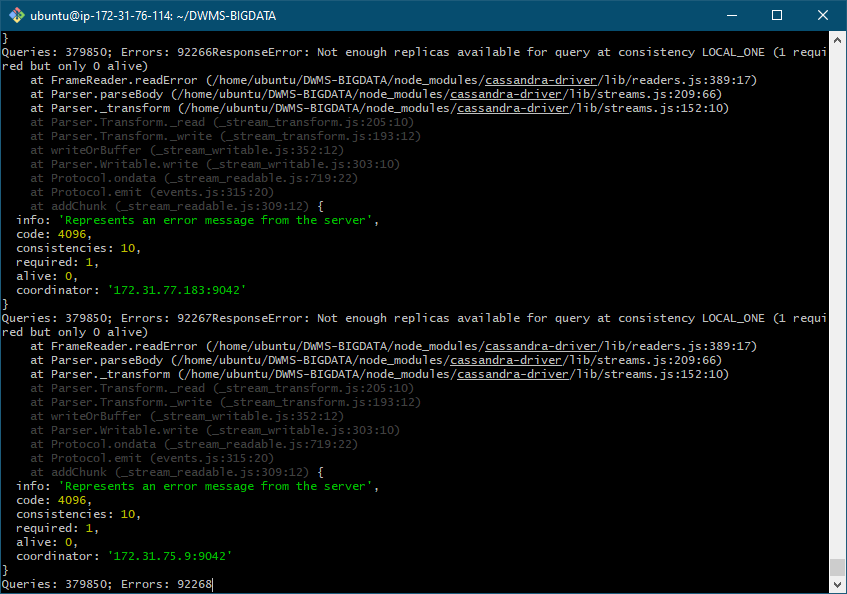

### 1. Create new table

Создать новую таблицу

```CQL
CREATE TABLE timur.task5
(
    ID   int PRIMARY KEY,
    NAME text
);
```

### 2. Endless insert cycle
Бесконечный цикл

+ [NodeJS script](insert.js)

Спустя 5 минут было выполнено 333391 запросов:


### 3. Fall of the node

```bash
ps axu | grep cassandra
sudo kill -9 <pid>
nodetool status
```


На упавшей ноде упал график сети процессора и освободилать оперативная память:


##### Errors
Из-за настроек репликации кассандры она не смогла принимать больше данных


### 4. Rise of the node

```bash
sudo systemctl restart cassandra
```


Нагрузка на ноду восстановилась:


