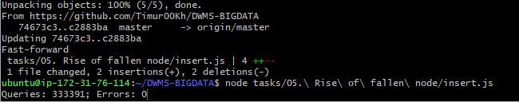
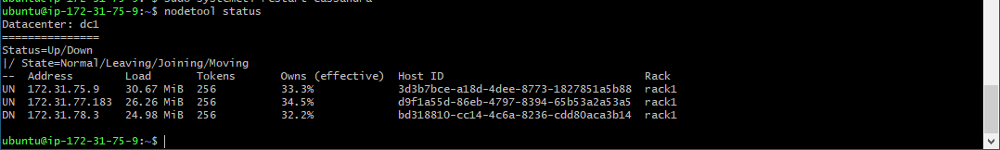
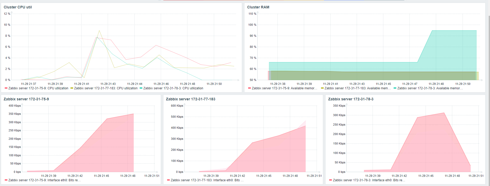
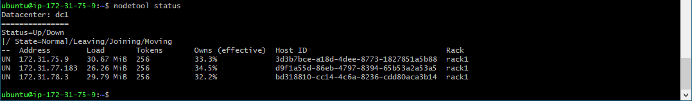
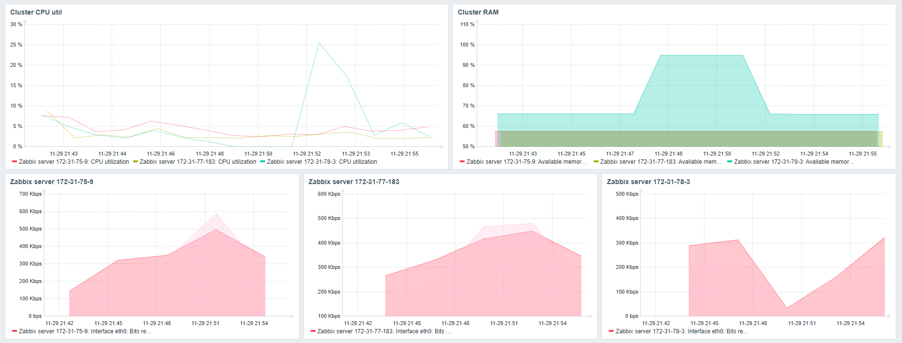

# 05. Rise of fallen node

На существующий кластер Cassandra (3 узла) запустить трафик вставки данных который генерируется 4 узлом EC2 в бесконечном цикле

Подождать 5-10 минут для получения статистики в Мониторинговой системе по RAM / CPU / IOPS по каждой из EC2 кластера Cassandra

Выбрать один из EC2 серверов Cassandra и сделать “kill -p pid” - где pid - process id cassandra (можно получить через команду ps -ef | grep cassandra).
ВНИМАНИЕ! Обязательно сделайте “жесткую” остановку сервиса не через команды работы с сервисами systemctl / service

Посмотреть результаты работы поступающего трафика  и отправить скрины по
+ мониторинговым графикам
+ nodetool status


Не выключая поступающего трафика - сделайте возврат процесса / узла обратно в кластер Cassandra
Посмотреть результаты работы поступающего трафика после возвращения узла  и отправить скрины по
+ мониторинговым графикам
+ nodetool status


### 1. Create new table

Создать новую таблицу

```CQL
CREATE TABLE timur.task5
(
    ID   int PRIMARY KEY,
    NAME text
);
```

### 2. Endless insert cycle
Бесконечный цикл

+ [NodeJS script](insert.js)

Спустя 5 минут было выполнено 333391 запросов:


### 3. Fall of the node

```bash
ps axu | grep cassandra
sudo kill -9 <pid>
nodetool status
```



На упавшей ноде упал график сети процессора и освободилать оперативная память:



### 4. Rise of the node

```bash
sudo systemctl restart cassandra
```



Нагрузка на ноду восстановилась:



