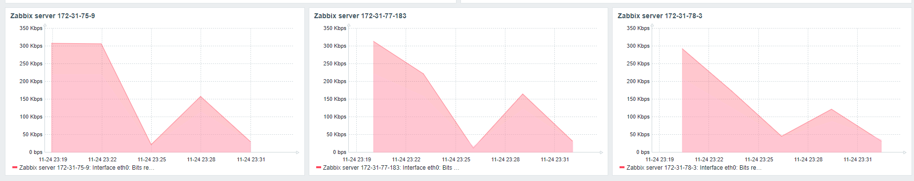
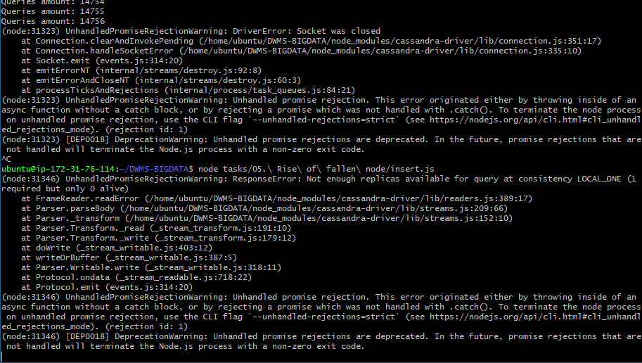

### 1. Create new table

Создать новую таблицу

```CQL
CREATE TABLE timur.task5
(
    ID   int PRIMARY KEY,
    NAME text
);
```

### 2. Endless insert cycle
Бесконечный цикл

+ [NodeJS script](insert.js)

### 3. Fall of the node

```bash
ps axu | grep cassandra
sudo kill -9 <pid>
nodetool status
```




##### Error


### 4. Rise of the node

```bash
sudo systemctl restart cassandra
```


