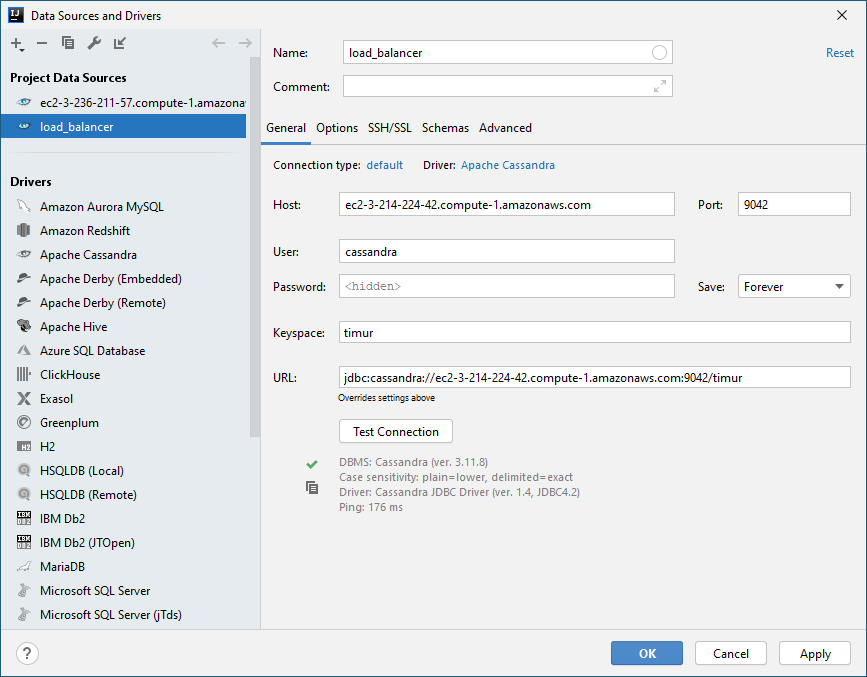
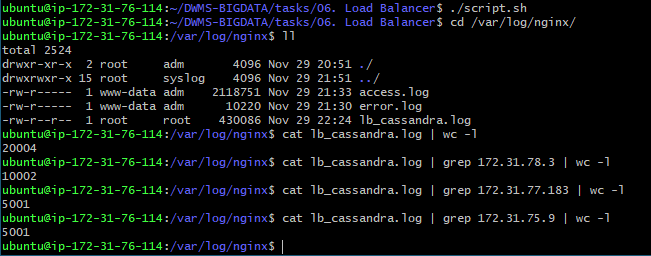
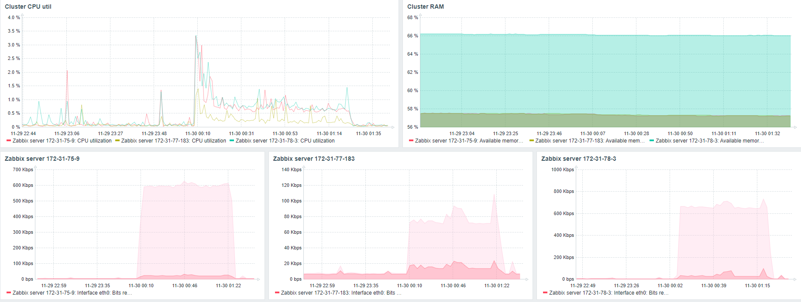

### 1. Nginx load balancer config

Создать новую таблицу

```cql
CREATE TABLE timur.task6
(
    ID   int PRIMARY KEY,
    NAME text
);
```
#### Nginx config

+ [lb_cassandra.conf](./lb_cassandra.conf)

### 2. Data Grip connection



### 3. Create a table and insert 10k rows

Баш скрипт, который создает новый коннекшен на каждую вставку:
+ [script.sh](./script.sh)

Посчитал кол-во запросов на ноды с помощью логов Nginx:


График нагрузки из Zabbix:

