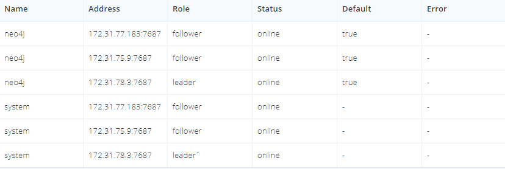
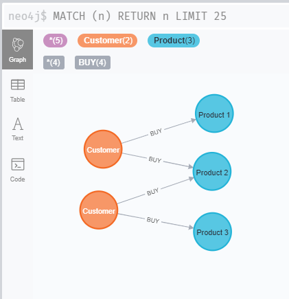

### 1. Download Neo4j


```bash
wget -O - https://debian.neo4j.com/neotechnology.gpg.key | sudo apt-key add -
echo 'deb https://debian.neo4j.com stable latest' | sudo tee /etc/apt/sources.list.d/neo4j.list
sudo apt-get update
sudo apt-get install neo4j-enterprise
```

### 2. Config for Neo4j master
#####`/etc/neo4j/neo4j.conf`
```
dbms.default_advertised_address=172.31.78.3

dbms.mode=CORE
causal_clustering.minimum_core_cluster_size_at_formation=3
causal_clustering.minimum_core_cluster_size_at_runtime=3
causal_clustering.initial_discovery_members=172.31.78.3:5000,172.31.77.183:5000,172.31.75.9:5000
causal_clustering.discovery_listen_address=0.0.0.0:5000
causal_clustering.transaction_listen_address=0.0.0.0:6000
causal_clustering.raft_listen_address=0.0.0.0:7000
dbms.connector.bolt.listen_address=0.0.0.0:7687
dbms.connector.http.listen_address=0.0.0.0:7474
#dbms.connector.https.listen_address
dbms.backup.listen_address=0.0.0.0:6362
```
```
sudo service neo4j restart
```


### 3. Config for Neo4j replicas
#####`/etc/neo4j/neo4j.conf`
```
dbms.default_advertised_address=<aws_private_ip>

causal_clustering.discovery_listen_address=0.0.0.0:5000
causal_clustering.transaction_listen_address=0.0.0.0:6000
causal_clustering.raft_listen_address=0.0.0.0:7000
dbms.connector.bolt.listen_address=0.0.0.0:7687
dbms.connector.http.listen_address=0.0.0.0:7474
dbms.backup.listen_address=0.0.0.0:6362
```


### 3. Connect
`http://ec2-18-232-38-159.compute-1.amazonaws.com:7474/browser/`

#### Check cluster
`:sysinfo`



### 4. Add data 

```
create (c1: Customer {id: 1, name: 'Customer 1'})
create (c2: Customer {id: 2, name: 'Customer 2'})

create (p1: Product {id: 1, name: 'Product 1', price: 100})
create (p2: Product {id: 2, name: 'Product 2', price: 150})
create (p3: Product {id: 3, name: 'Product 3', price: 85})
```

```
match (c: Customer {id: 1}), (p: Product {id: 1})
	create (c) - [:BUY {date: '22.11.2020'}] -> (p)
```
```
match (c: Customer {id: 1}), (p: Product {id: 2})
	create (c) - [:BUY {date: '17.11.2020'}] -> (p)
```
```
match (c: Customer {id: 2}), (p: Product {id: 2})
	create (c) - [:BUY {date: '14.11.2020'}] -> (p)
```
```
match (c: Customer {id: 2}), (p: Product {id: 3})
	create (c) - [:BUY {date: '25.11.2020'}] -> (p)
```

### 5. Show data

```
MATCH (n) RETURN n LIMIT 25
```



### Links
+ [Set up a local Causal Cluster (official docs)](https://neo4j.com/docs/operations-manual/current/tutorial/local-causal-cluster/)
+ [Установка Neo4j на Ubuntu/Debian](https://1cloud.ru/help/linux/ustanovka-neo4j-na-ubuntu-debian)
### Commands

```
sudo nano /etc/neo4j/neo4j.conf
sudo neo4j status
sudo neo4j start
sudo neo4j restart
sudo tail /var/log/neo4j/neo4j.log
sudo tail -n100 /var/log/neo4j/neo4j.log
sudo service neo4j stop
sudo netstat -tulpn | grep LISTEN
```

