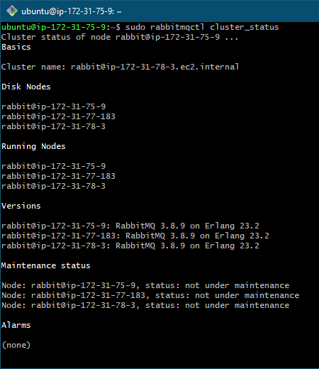
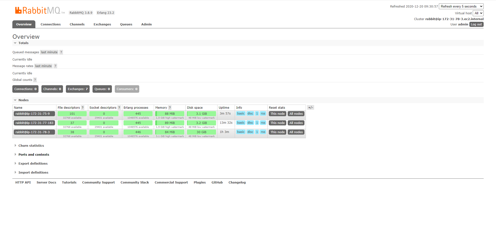
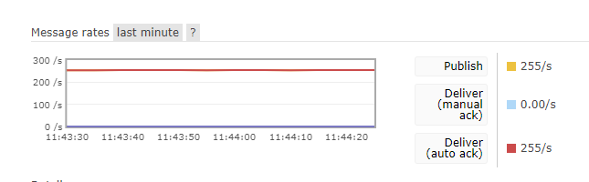
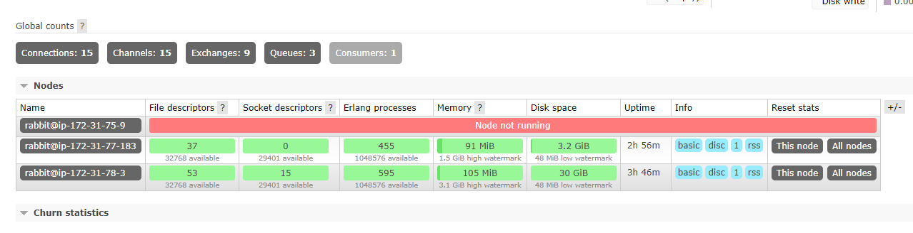
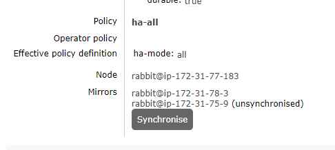

# 08. RabbitMQ

### 1. Download and install RabbitMQ


```bash
wget https://packages.erlang-solutions.com/erlang-solutions_1.0_all.deb
sudo dpkg -i erlang-solutions_1.0_all.deb
sudo apt-get update
sudo apt-get install erlang

sudo apt-get update
sudo apt-get -y install socat logrotate init-system-helpers adduser
wget https://github.com/rabbitmq/rabbitmq-server/releases/download/v3.8.9/rabbitmq-server_3.8.9-1_all.deb
sudo dpkg -i rabbitmq-server_3.8.9-1_all.deb

sudo service rabbitmq-server status
rm erlang-solutions_1.0_all.deb
rm rabbitmq-server_3.8.9-1_all.deb
```

```
sudo rabbitmq-plugins enable rabbitmq_management
```

### 2. Copy RabbitMQ cookie


```
# on master node
sudo cat /var/lib/rabbitmq/.erlang.cookie && echo
# --> "RABBITMQ_COOKIE"

# insert master cookies to all replicas
sudo nano /var/lib/rabbitmq/.erlang.cookie
```

### 2. Clustering RabbitMQ nodes

```
sudo systemctl restart rabbitmq-server
sudo rabbitmqctl stop_app
sudo rabbitmqctl reset
# ip-172-31-78-3 - aws dns from console
sudo rabbitmqctl join_cluster rabbit@ip-172-31-78-3
sudo rabbitmqctl start_app
sudo rabbitmqctl cluster_status

sudo rabbitmqctl list_policies
sudo rabbitmqctl set_policy ha-all ".*" '{"ha-mode":"all"}'

sudo rabbitmq-plugins enable rabbitmq_management
```



### 3. Check status with Web Frontend

```
# on master node
sudo rabbitmqctl add_user admin qwerty007
sudo rabbitmqctl set_user_tags admin administrator
```




### 4. Create producers and consumer

```
# consumer
export MODE=consumer && node "tasks/08. RabbitMQ/script.js"

# producers [x5]
export MODE=producer && node "tasks/08. RabbitMQ/script.js"
```



```
sudo kill -9 1894
```






### Links
+ [Installing on Debian and Ubuntu (official docs)](https://www.rabbitmq.com/install-debian.html#manual-installation)
+ [How to Install Erlang on Ubuntu 18.04 & 16.04 LTS](https://tecadmin.net/install-erlang-on-ubuntu/)
+ [Как настроить кластер RabbitMQ в Ubuntu 18.04 LTS](https://itisgood.ru/2018/12/11/kak-nastroit-klaster-rabbitmq-v-ubuntu-18-04-lts/)

### Commands
+ Web Frontend port: `15672`

```
apt --fix-broken install
sudo systemctl start rabbitmq-server
```

