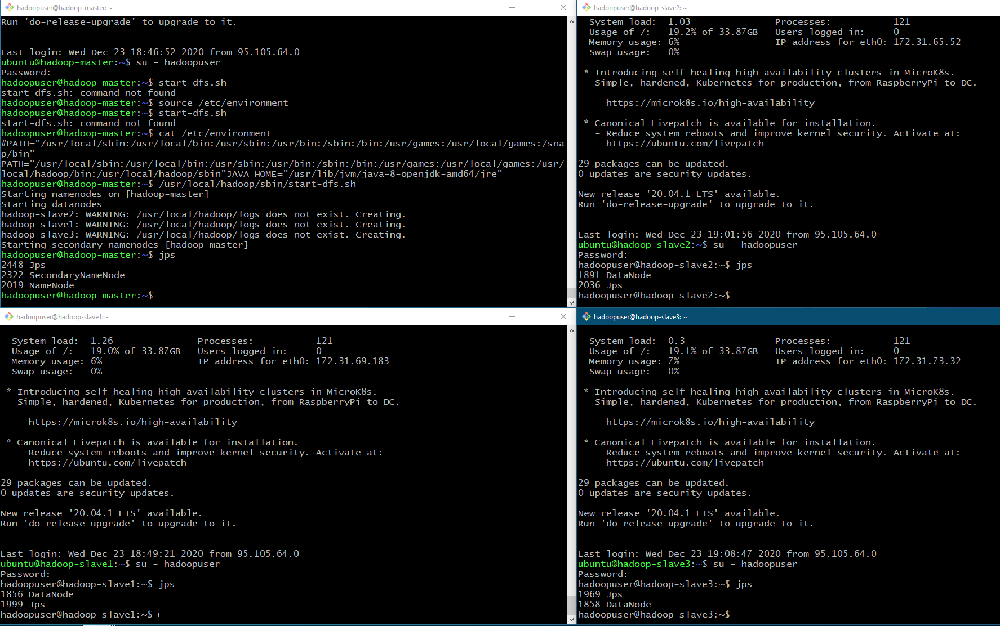
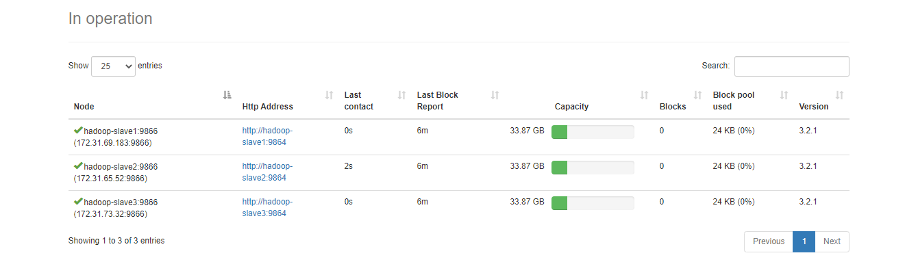
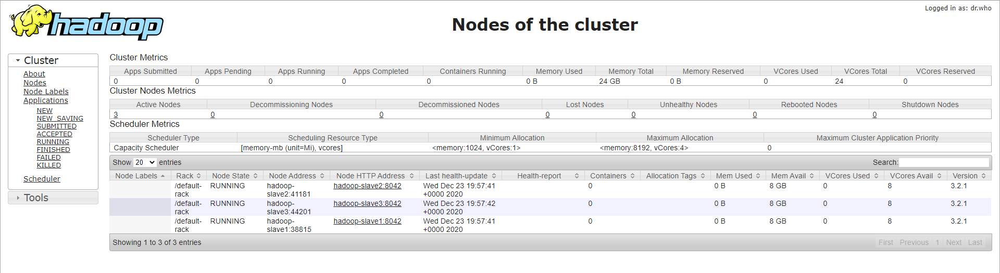
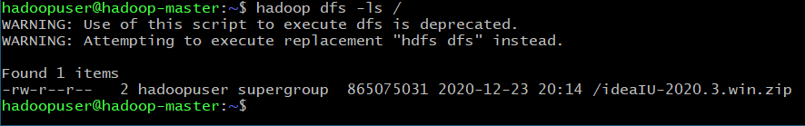

# 09. HDFS

## 1. развернуть кластер HDFS (x4 ноды)

Делал по данному мануалу: [How To Set Up a Hadoop 3.2.1 Multi-Node Cluster](https://medium.com/@jootorres_11979/how-to-set-up-a-hadoop-3-2-1-multi-node-cluster-on-ubuntu-18-04-2-nodes-567ca44a3b12)

#### Вспомогательные команды:

```
sudo apt install -y pdsh
echo "export PDSH_RCMD_TYPE=ssh" >> .bashrc
ssh-keygen -t rsa -P ""
cat ~/.ssh/id_rsa.pub >> ~/.ssh/authorized_keys
ssh localhost

sudo wget -P ~ https://mirrors.sonic.net/apache/hadoop/common/hadoop-3.2.1/hadoop-3.2.1.tar.gz
tar xzf hadoop-3.2.1.tar.gz
mv hadoop-3.2.1 hadoop
nano ~/hadoop/etc/hadoop/hadoop-env.sh
```

```
sudo nano /etc/hosts
```

```
172.31.78.3     hadoop-master
172.31.69.183   hadoop-slave1
172.31.65.52    hadoop-slave2
172.31.73.32    hadoop-slave3
```
```
ssh hadoopuser@hadoop-master
ssh hadoopuser@hadoop-slave1
ssh hadoopuser@hadoop-slave2
ssh hadoopuser@hadoop-slave3
```

```
sudo passwd hadoopuser
```

```
echo "export PDSH_RCMD_TYPE=ssh" >> ~/.bashrc
```

## 2. Проиницилизировать одну MasterNode и 3 DataNodes








## 3. Проверить работоспособность всего кластера через `hdfs status`

```bash
hadoopuser@hadoop-master:~$ hdfs dfsadmin -report
Configured Capacity: 109089951744 (101.60 GB)
Present Capacity: 88134045696 (82.08 GB)
DFS Remaining: 88133959680 (82.08 GB)
DFS Used: 86016 (84 KB)
DFS Used%: 0.00%
Replicated Blocks:
        Under replicated blocks: 0
        Blocks with corrupt replicas: 0
        Missing blocks: 0
        Missing blocks (with replication factor 1): 0
        Low redundancy blocks with highest priority to recover: 0
        Pending deletion blocks: 0
Erasure Coded Block Groups:
        Low redundancy block groups: 0
        Block groups with corrupt internal blocks: 0
        Missing block groups: 0
        Low redundancy blocks with highest priority to recover: 0
        Pending deletion blocks: 0

-------------------------------------------------
Live datanodes (3):

Name: 172.31.65.52:9866 (hadoop-slave2)
Hostname: hadoop-slave2
Decommission Status : Normal
Configured Capacity: 36363317248 (33.87 GB)
DFS Used: 28672 (28 KB)
Non DFS Used: 7068090368 (6.58 GB)
DFS Remaining: 29278420992 (27.27 GB)
DFS Used%: 0.00%
DFS Remaining%: 80.52%
Configured Cache Capacity: 0 (0 B)
Cache Used: 0 (0 B)
Cache Remaining: 0 (0 B)
Cache Used%: 100.00%
Cache Remaining%: 0.00%
Xceivers: 1
Last contact: Wed Dec 23 20:02:18 UTC 2020
Last Block Report: Wed Dec 23 19:39:51 UTC 2020
Num of Blocks: 0


Name: 172.31.69.183:9866 (hadoop-slave1)
Hostname: hadoop-slave1
Decommission Status : Normal
Configured Capacity: 36363317248 (33.87 GB)
DFS Used: 28672 (28 KB)
Non DFS Used: 6883782656 (6.41 GB)
DFS Remaining: 29462728704 (27.44 GB)
DFS Used%: 0.00%
DFS Remaining%: 81.02%
Configured Cache Capacity: 0 (0 B)
Cache Used: 0 (0 B)
Cache Remaining: 0 (0 B)
Cache Used%: 100.00%
Cache Remaining%: 0.00%
Xceivers: 1
Last contact: Wed Dec 23 20:02:20 UTC 2020
Last Block Report: Wed Dec 23 19:39:56 UTC 2020
Num of Blocks: 0


Name: 172.31.73.32:9866 (hadoop-slave3)
Hostname: hadoop-slave3
Decommission Status : Normal
Configured Capacity: 36363317248 (33.87 GB)
DFS Used: 28672 (28 KB)
Non DFS Used: 6953701376 (6.48 GB)
DFS Remaining: 29392809984 (27.37 GB)
DFS Used%: 0.00%
DFS Remaining%: 80.83%
Configured Cache Capacity: 0 (0 B)
Cache Used: 0 (0 B)
Cache Remaining: 0 (0 B)
Cache Used%: 100.00%
Cache Remaining%: 0.00%
Xceivers: 1
Last contact: Wed Dec 23 20:02:20 UTC 2020
Last Block Report: Wed Dec 23 19:40:08 UTC 2020
Num of Blocks: 0
```


## 4. Сохранить большой файл

Скачал установочник IDE от JetBrains

```
# Скачал установочник IDE от JetBrains
wget https://download.jetbrains.com/idea/ideaIU-2020.3.win.zip # 825.00M

# Загрузил файл в hdfs
hadoop fs -put ideaIU-2020.3.win.zip /ideaIU-2020.3.win.zip

hadoop dfs -ls /
```



