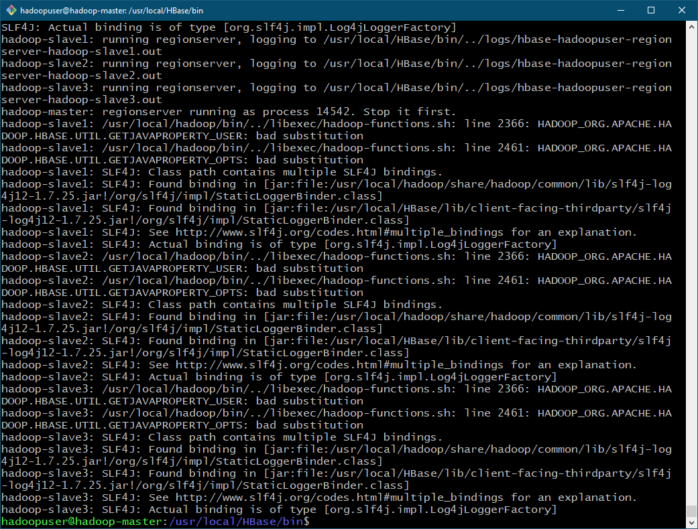

# 10. HBase

1. Используя существующие узлы EC2 с HDFS развернуть кластер HBase
1. Проиницилизировать HBase 
1. Развернуть на тех же EC2 узлах Zookeeper + Hue
1. Показать доступность Hue через web интерфейс
1. Создать таблицу в HBase и сохранить через Python / Java 10 000 строк с вашим выбранным ключом - укажите префикс для ключа как номер RegionServer

## 1. Используя существующие узлы EC2 с HDFS развернуть кластер HBase

### 1.1 Download
```
VER="2.2.6"
wget http://apache-mirror.rbc.ru/pub/apache/hbase/stable/hbase-$VER-bin.tar.gz

tar xvf hbase-$VER-bin.tar.gz
sudo mv hbase-$VER/ /usr/local/HBase/
```

### 1.2 Configure environment


```
sudo nano /etc/profile.d/hadoop_java.sh

export JAVA_HOME=$(dirname $(dirname $(readlink $(readlink $(which javac)))))
export HADOOP_HOME=/usr/local/hadoop
export HADOOP_HDFS_HOME=$HADOOP_HOME
export HADOOP_MAPRED_HOME=$HADOOP_HOME
export YARN_HOME=$HADOOP_HOME
export HADOOP_COMMON_HOME=$HADOOP_HOME
export HADOOP_COMMON_LIB_NATIVE_DIR=$HADOOP_HOME/lib/native
export HBASE_HOME=/usr/local/HBase
export PATH=$PATH:$JAVA_HOME/bin:$HADOOP_HOME/bin:$HADOOP_HOME/sbin:$HBASE_HOME/bin

source /etc/profile.d/hadoop_java.sh
sudo nano /usr/local/HBase/conf/hbase-env.sh

export JAVA_HOME=/usr/lib/jvm/java-8-openjdk-amd64/

source /usr/local/HBase/conf/hbase-env.sh
```


### 1.3 Configure HBase

`
sudo nano /usr/local/HBase/conf/hbase-site.xml
`

```
<configuration>
    <property>
        <name>hbase.master</name>
        <value>hadoop-master:60000</value>
    </property>
   <property>
      <name>hbase.rootdir</name>
      <value>hdfs://localhost:9000/hbase</value>
   </property>
   <property>
      <name>hbase.zookeeper.property.dataDir</name>
      <value>/hadoop/zookeeper</value>
   </property>
   <property>
     <name>hbase.cluster.distributed</name>
     <value>true</value>
   </property>
</configuration>
```

Ensure Zookeeper directory is created.

```
sudo mkdir -p /hadoop/zookeeper
sudo chown -R hadoopuser:hadoopuser /hadoop/
```
```
sudo nano /usr/local/HBase/conf/regionservers

hadoop-master
hadoop-slave1
hadoop-slave2
hadoop-slave3
```

```
/usr/local/HBase/bin/start-hbase.sh
```



Столкнулся с проблемой, не могу решить пока что


# Links 

+ [HBase Installation on Ubuntu](https://www.guru99.com/hbase-installation-guide.html)
+ [Install Apache Hadoop / HBase on Ubuntu](https://computingforgeeks.com/how-to-install-apache-hadoop-hbase-on-ubuntu/)


#### Start HDFS after reboot

```
/usr/local/hadoop/sbin/start-dfs.sh
/usr/local/hadoop/sbin/start-yarn.sh
```
